# Assembling the Electronics Enclosure

## 3D Printing 

### The Box

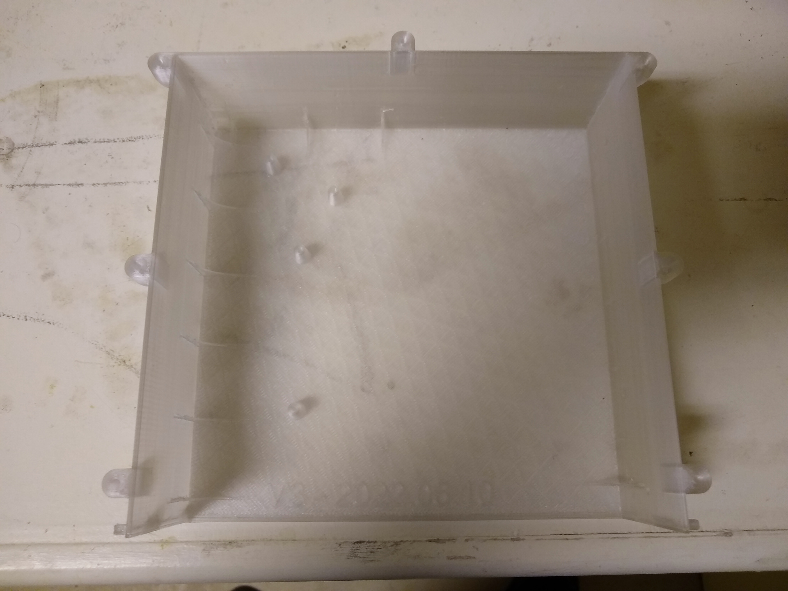

First, you want to print the box. It's fairly large, about 210mm on each side. It will fit on the build plate
on a 220mm x 220mm 3D printer. I tried a few ways, here's what worked consistently for me:

* Print in Hatchbox brand transparent PETG with an 80&deg; bed and 235&deg; nozzle.
* Scale the model to 101% before printing to allow for thermal contraction to the correct final size after printing.
* Print with part cooling fan speed low, but non zero. I used 25% speed.
* Print on a glass bed inside an enclosure. This limits warping, delamination, and/or loss of bed adhesion.
* Use a 0.6mm diameter nozzle at 0.2mm layer height. With these settings, the box takes about 18 hours to complete.
* Print with an 8mm brim to keep the sharp corners from lifting.
* Use a generous coat of purple glue stick on the bed to ensure good bed adhesion.
* Use a wall line count of 4. This keeps the screw holes surrounded by several lines of solid plastic to tap into.
* Print the initial layer at 15mm/s. I found this helped ensure good adhesion.
* Use 20% infill (triangles). This is of minor importance as most of the box will print solid with these settings.

---
### The Lid

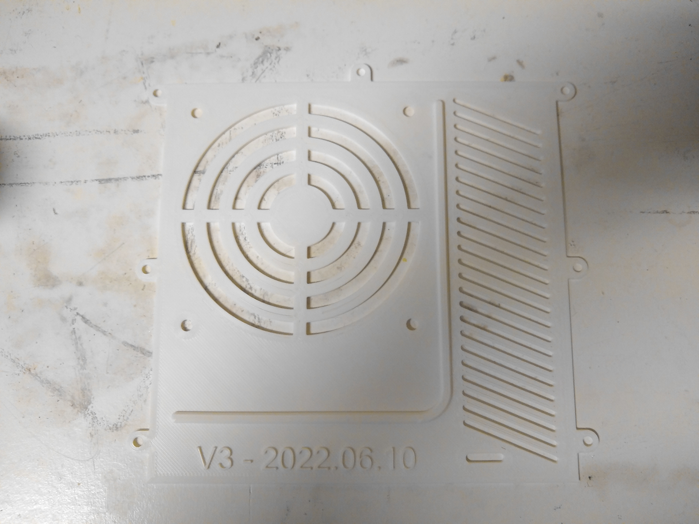

After you get the box right, print a lid to match. It's roughly the same dimensions, but relatively flat so it will
be less affected by warping due to close proximity to a heated bed. This was easier to get right than the
PETG box, and I found only a subset of those settings was required to get a good result.

* Print in Hatchbox brand white ABS with a 100&deg; bed and 225&deg; nozzle.
* Scale the model to 101% before printing to allow for thermal contraction to the correct final size after printing.
* Print with part cooling fan low but non zero. I used 25% speed.
* Print on a glass bed.
* Print with an 8mm brim to keep the sharp corners from lifting.
* Use a 0.6mm diameter nozzle at 0.2mm layer height. With these settings, each lid takes about 8 hours to complete.
* Use 5 line thick walls - this improves printing speed due to more efficient print head movements.
* Print the initial layer at 15mm/s. I found this helped ensure good adhesion.
* Use 20% infill (triangles). This is of minor importance as most of the box will print solid with these settings.

---
## Tapping Threads

TODO: Photograph and describe this.

---

## Assembling the Internals

### Step 0

Verify the power supply is set to the correct voltage for your local mains.

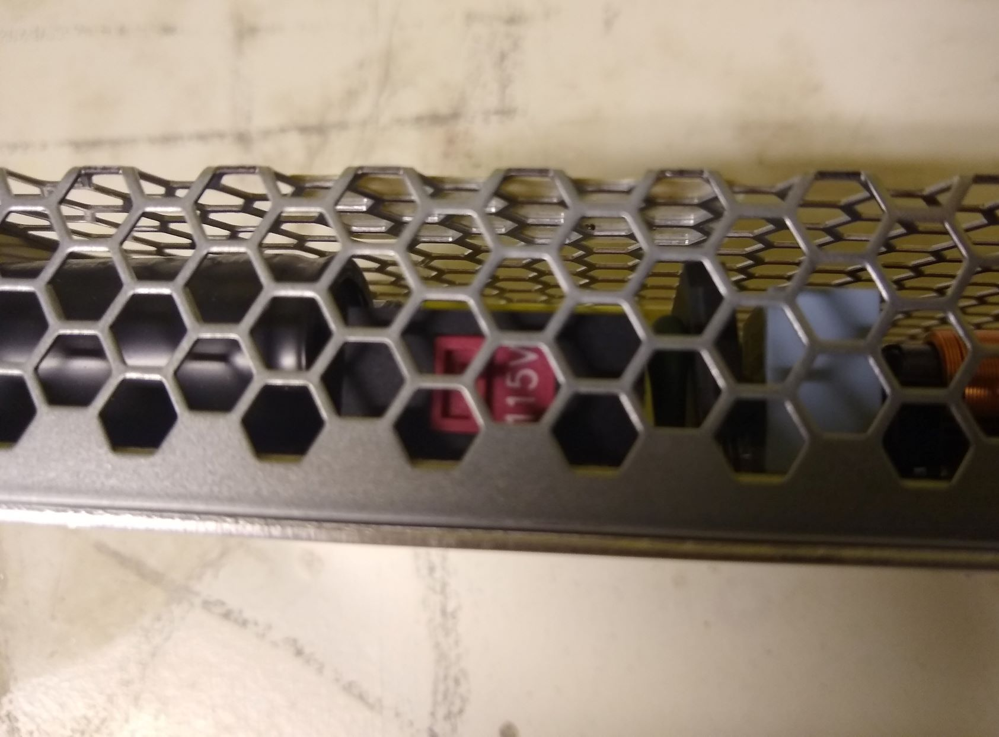

### Step 1
Begin by putting the 12V Power supply into the box. Attach it with three M3 screws on the right side of the box.

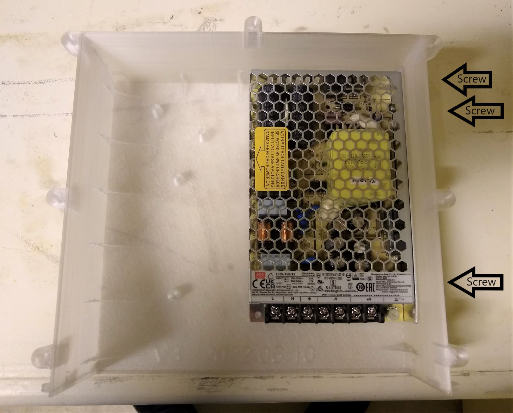

### Step 2
Next, strip both ends of a pair of wires. I used the following:

* Red / Positive - 21cm (8.25in) of 24AWG stranded wire
* Black / Negative - 20cm (8in) of 24AWG stranded wire

For each wire, strip one end back about 8mm and fix it into the screw terminals 
on the power supply, red should go to `+V` and black to `-V`. Strip the other end about 4mm and leave them for the next step.
It should look like this.

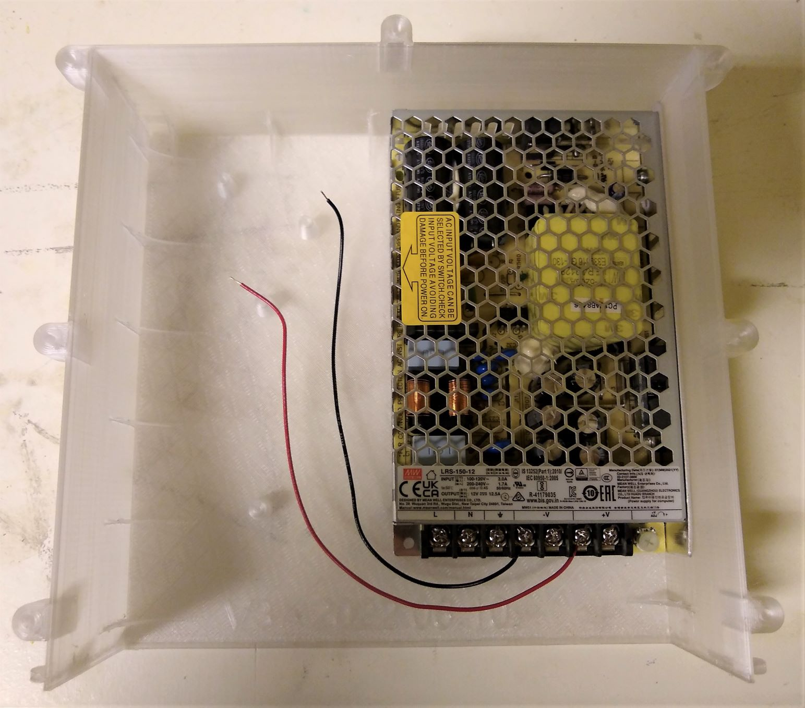

### Step 3
Next we need to adjust a buck converter to buck down to 5V from the factory set voltage. 
Use a voltage source like a bench power supply or 9V battery to produce a voltage 
somewhat greater than the 5V required by the ESP32 dev board. Connect it to the 
`+in` and `-in` solder terminals on the buck converter. Then use a digital 
multimeter to read the voltage on the output terminals. Turn counterclockwise 
until the voltage is bucked down to 5V. **Note**: many buck converters come 
pre-set to a voltage many times higher than 5V. You will need to apply 
a **large number** of counterclockwise turns before you will see a noticable 
bucking effect on voltage.

I suggest adjusting to within 5.00&#xb1;0.05V.

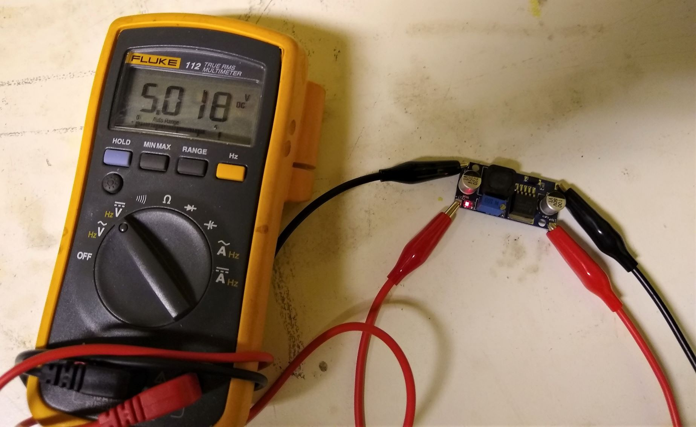

### Step 4
Solder the `+in` terminal of the buck converter to the red wire, and the `-in` terminal
to the black wire. This can be done most easily using "helping hands" type
soldering aids to hold the wires and converter in position over the box
while soldering. I recommend investing in a Panavise 350 and "Third Hand"
PanaHand add-on or similar to make this and all your future soldering projects easier.

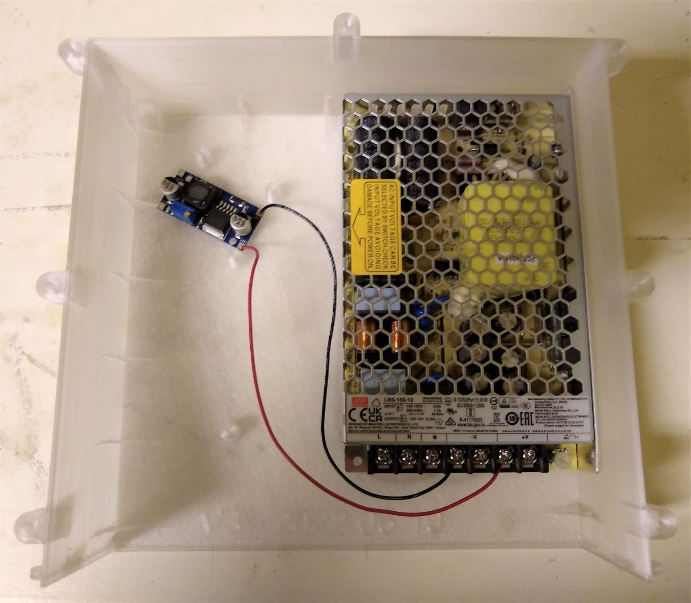

### Step 5
Next, solder wire leads to the lower voltage side of the buck converter. I
used the following:

* Red / Positive - 11.5cm (4.5in) of 24AWG stranded wire
* Black / Negative - 14cm (5.5in) of 24AWG stranded wire

I stripped both ends of the wires back about 4mm, and soldered one end to
the buck converter. When you're done, you can turn your soldering iron back off. 
It's screw terminals and screwdrivers for a while now.

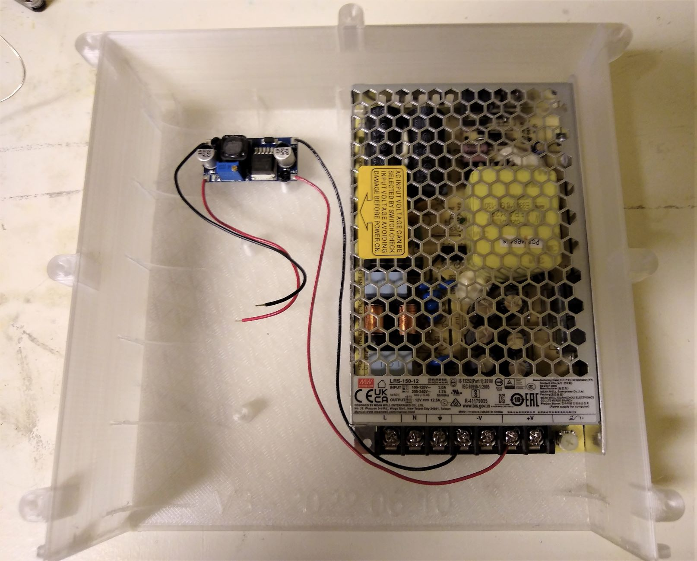

### Step 6
Now go ahead and fasten the buck converter and soldered PCB with four M3 screws
to the tapped holes in the box using two screws each. Screw down the red and black wires
from the buck converter into the 5V input terminal on the PCB as shown
in the photo below. Take care to use the lower 5V terminal rather than the upper 12V
terminal, and to use the correct polarity (red above black).

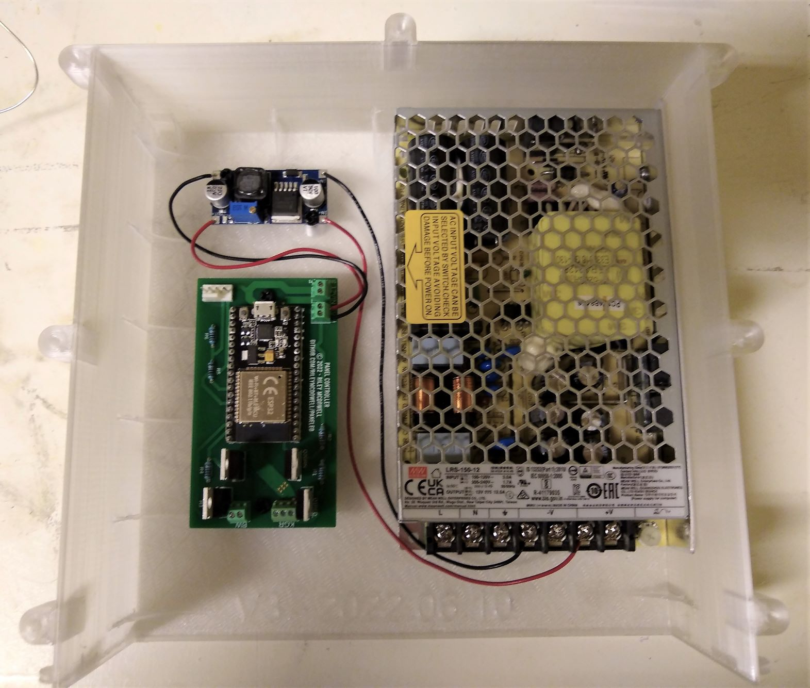

### Step 7
Next add in the 12V supply wires. These wires need to be able to carry the 
full current of the LED strip at maximum brightness for an indefinite period. 
For that reason, I used slightly different wires with higher current capacity
for this application.

* Red / Positive - 20cm (8in) of 22AWG solid copper wire
* Black / Negative - 18cm (7.25in) of 22AWG solid copper wire

<small><small>**Note**: 22AWG solid copper wire is rated for 7A of current in chassis wiring 
applications. In practice I have observed less than 50W power draw
for the panel at maximum brightness on all channels. 50W at 12V is about
4.2A, so this should be appropriately spec'd.</small></small>

Because these wires carry non-negligible current, be sure you are tightening
the screw terminals down securely. You will want to use high quality
precision screwdrivers to ensure a good, low resistance clamping connection. 

### Step 8

The 5050 LED kit I used came with a 5 conductor wiring plug, so I incorporated
it directly into this design. The 2+3 screw terminals line up with the WBRGK
wires, so clamp them down as well. Like before, use precision screwdrivers
to ensure secure, low resistance termination of the wires. Pay special 
attention to the black (labeled `k`) wire, as this is the 12V input 
for the strand and carries the full current of the entire light strip.
Get it nice and tight.

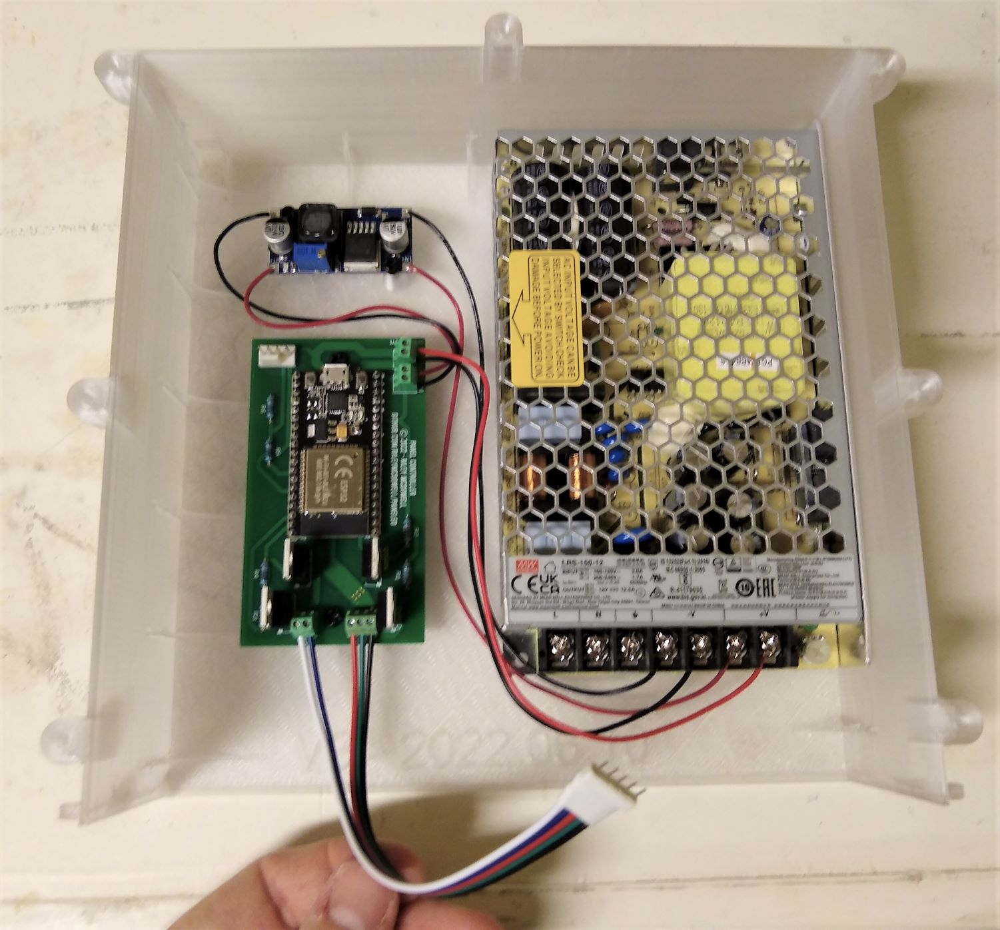

### Step 9

Fire up your soldering iron again, it's time to solder the IEC-320 C14 fused socket.
The correct wiring is shown below. These wires need not be any larger capacity than
the wires for the LED strip. I had some nice colors of silicone insulated wires
around, so I used them.

* Red / Line / L - 22AWG silicone insulated stranded wire
  * 9cm (3.5in)
  * 3cm (1in)
* Yellow / Neutral / N - 22AWG silicone insulated stranded wire
  * 9cm (3.5in)
  * 4.5cm (1.75in)
* Green / Ground / &#9178; - 22AWG silicone insulated stranded wire
  * 9cm (3.5in)

It takes considerable heat to get the terminals hot enough to solder,
so don't hesitate to crank your iron temperature up (say 275C) and hold it 
on the terminal for a bit to let a generous portion of solder flow 
into the hole in the terminal as well as between the strands of 
your wire. That worked for me even using lead-free solder.

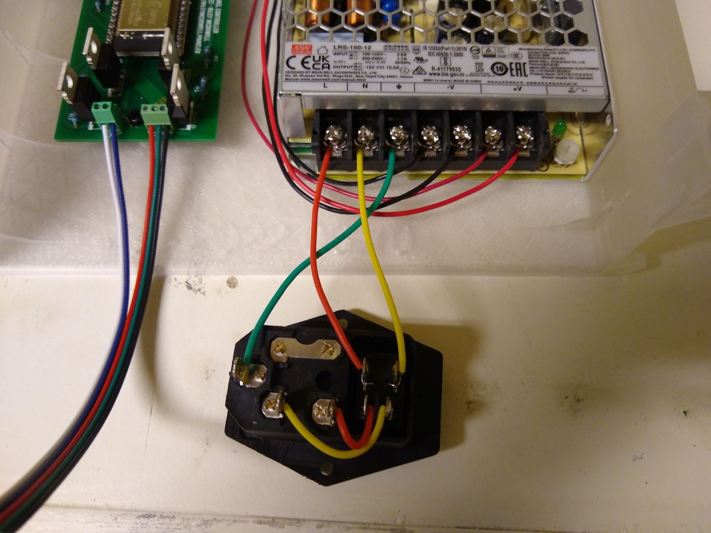

If you choose to add a 120mm cooling fan, get it out and 
rotate it as shown, with the wires oriented near the bottom
right.

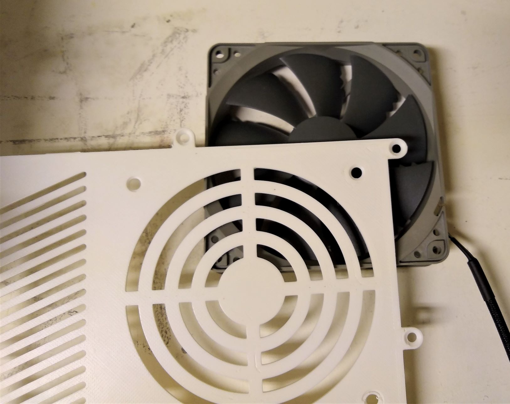

Make sure the fan is set to blow air _into_ the enclosure. The arrow
indicating airflow direction should point down, away from the lid.

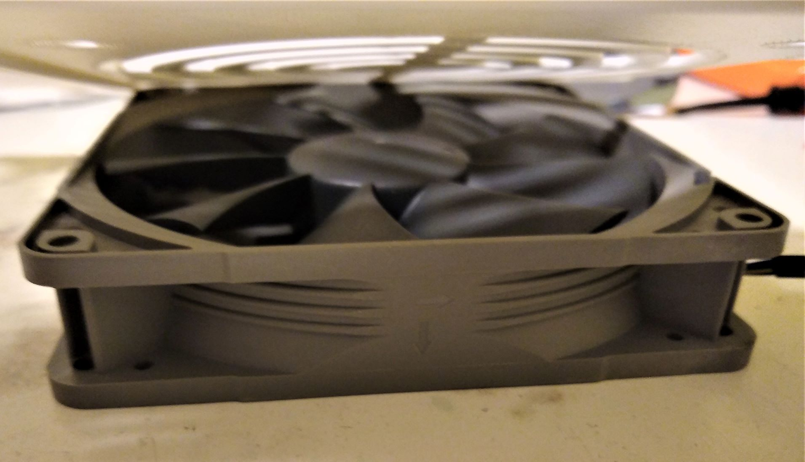

When you have the fan cable and fan airflow direction set, use the self-tapping
screws provided with the fan to screw it into the lid as shown.

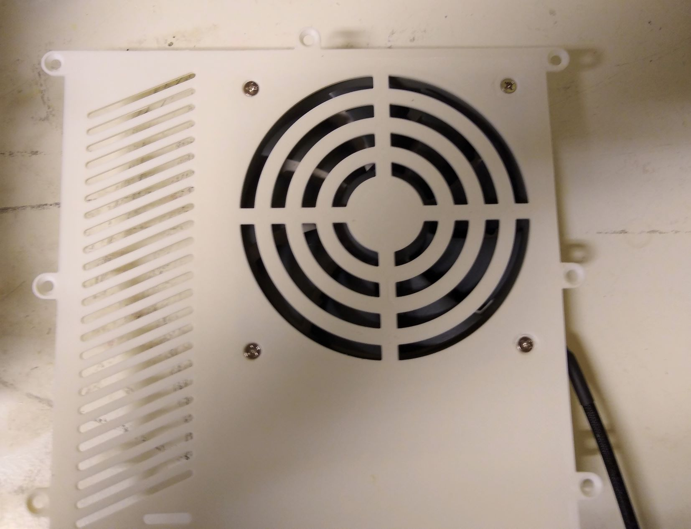

Connect the fan header to the main PCB.

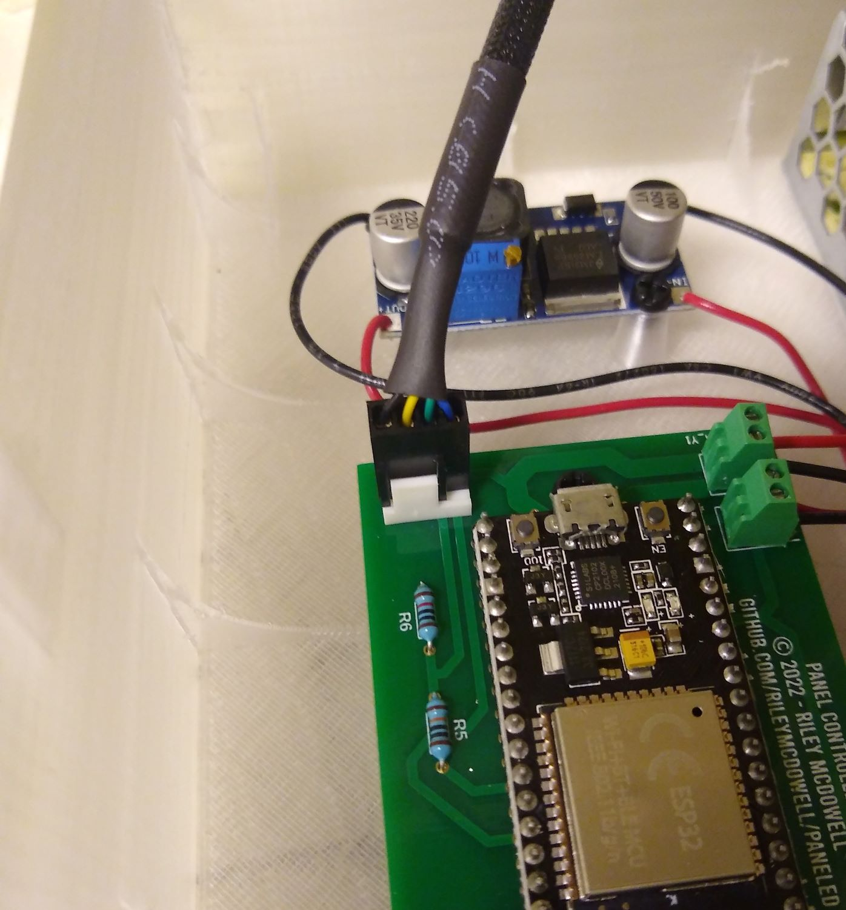

Use 7 M3.5 screws to attach the lid (with attached fan to the main enclosure box).
The placement of the fan cable is tricky. You want to trap the cable around
the sides of the fan, between the fan frame and the box walls. Be sure it doesn't 
end up trapped underneath the fan blades where it could interfere with the fan.
You also don't want to strain the cable where it leaves the fan or where the
header plugs into the PCB. It's not hard, but it does require careful alignment
while the lid is screwed on.

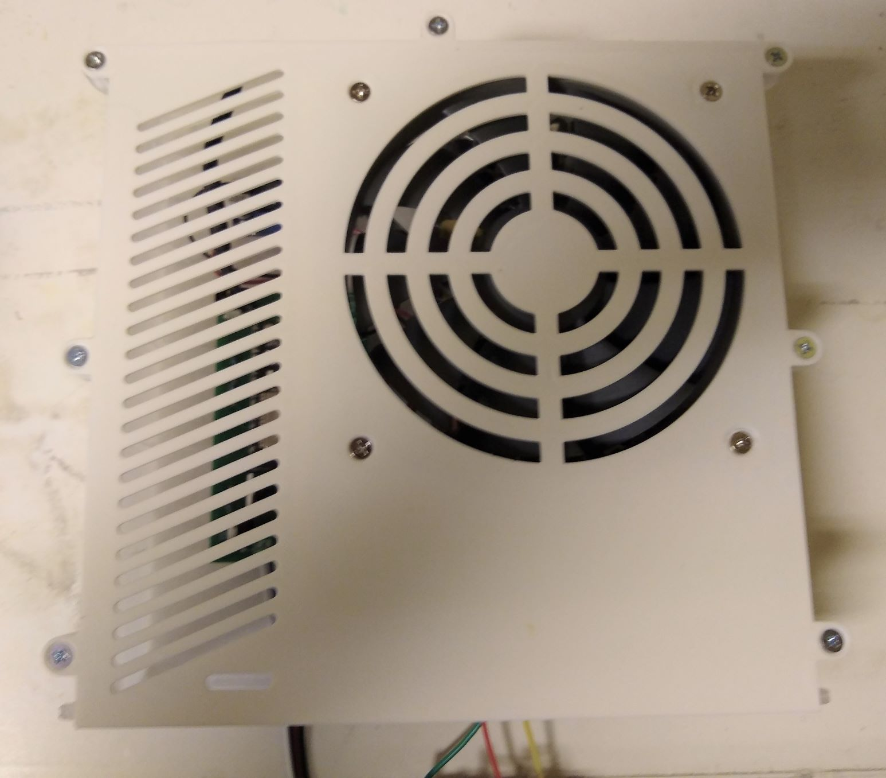

Last, fish the LED wire harness through the small slot in the bottom of the lid. 

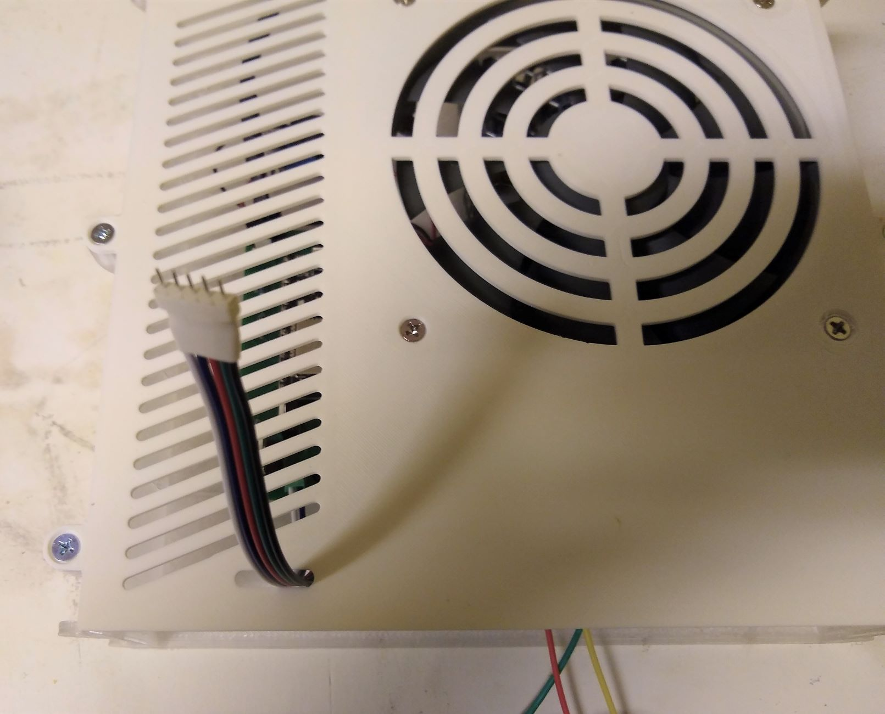

## _**Congratulations!**_ 

Your electronics enclosure is now assembled! 