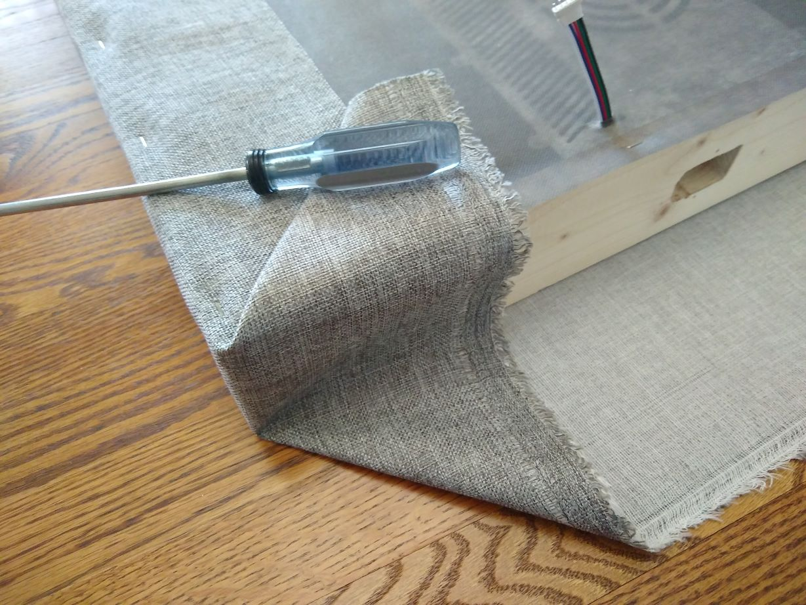

# Assembling the Panel

## Preparing the Boards

The wooden frame must be precisely sized to snugly hold the rockwool insulation 
inside by friction alone. The insulation is sized to work with United States 
customary units (inches) and the guide to the frame adopts the same conventional 
units. 

The insulation itself is sized so that two pieces stacked
vertically will friction fit between 24 inch on-center wall framing 
in an 8 foot tall wall framed with 2" x 4" lumber. To save on cost and 
weight, we'll use 1" x 4" pine boards but achieve an identical friction
fit. To do so, you'll want to cut the following pieces.

* 2 x 24 inch lengths of 1" x 4" lumber
* 2 x 47 inch lengths of 1" x 4" lumber

## Routing the Switch Plate 

One of the two 24 inch boards will need a hole routed out to allow the switch to pass through
between the outside and inside of the box. To do so, begin by tracing an outline of the 
switch onto the board.


When you are satisfied with your outline, drill a hole large enough to fit a router bit.
I chose to route the holes using a dremel with router attachement in a dremel
drill press, so a small hole was sufficient.


Fire up the dremel router and route out the hole. Even with pine, I had
to go very slow to avoid overheating the bit.


My holes usually came out too small, so I would finish them with a file
to make them slightly oversized.


This is how it should look when you're done. There should be some
slop/play in the hole. You'll be tucking fabric along all four sides
of the switch, so don't worry if your hole ends up a little too big.


Later on in construction, I learned that the pine is quite soft and the
construction screws self-tap easily, even through the fabric.
Drilling pilot holes is entirely optional. Note the small holes in
the top and bottom of the switch in this image.


When you're done, one of the two 24 inch boards should be ready to mount
a switch.


## The Wooden Frame

The 24 inch pieces are the top/bottom of the frame, with the 47 inch pieces
sandwiched in between. Nominal 1" x 4" pine boards have an actual thickness of 
3/4 inch, so the center area should measure exactly 47 inches by 22 1/2 inches.
Rockwool is intended to fit this sized space.

The following ASCII art illustrates the correct layout.

```
-------------------------
|        24 inch        |
-------------------------
|    |             |    |
|    |             |    |
|    |             |    |
|    |             |    |
|    |   22 1/2"   |    |
| 47 |      x      | 47 |
|inch|     47"     |inch|
|    |             |    |
|    |             |    |
|    |             |    |
|    |             |    |
-------------------------
|        24 inch        |
-------------------------
```

In each corner, drill two holes through the 24 inch board into the 47 inch board
sized to accomodate a #8 1-3/4 inch construction screw. A 1/8" drill bit
is a good size for most #8 screws, and 2 inch hole depth is sufficient. 
After drilling the hole, use a countersink bit to create a
conical cavity to recess the construction screw head. Finally,
install the construction screw. The hole should look as shown 
below (with one screw installed and one about to be installed).


---
## Installing the Electronic Box

Mounting the electronics box is really easy. Pick a side of the frame to be the "back".
Be sure to check the orientation of the panel mount switch - it only installs one way. If
you're doing multiple panels, you'll want to choose the same "back" on each one so 
the switches all face the same way.


Line the box up flush with the side you've chosen as the "back" and screw it down
with four 3/4 inch #6 construction screws, two per side. Pilot holes are not 
needed since the wood is so soft. Don't worry about getting the electronics
enclosure placed precisely in the center along the 24" board. You'll score and
cut each batt of Rockwool inslulation custom to each frame to ensure
a perfect fit. A visual estimate of center is sufficient.


---
## Fitting the RockWool

Begin by laying the panel face up, with the electronics access door facing the floor.


Place a batt of rockwool on top of the frame, leaving room to see the electronics box. Make a mark to indicate the right and left sides of the
electronics box (only one of the two marks is indicated below). 
Because rockwool is soft and pliable, accuracy is not critical. 
Careful visual alignment is all that is required to position the lines.


Using a sharp utility knife and the two marks, score the rockwool batt
in the rough shape of the electronics box. Again, accuracy is not critical.

Once scored, use the utility knife to cut a 2-3 cm thick square of 
rockwool out of the scored area. This square will be used to fill 
the area behind the electronics box cutout.


You should be left with a nice square of rockwool and a rough
surface cutout approximately the size of the electronics box.


Next use a sharp serrated knife or thin saw blade to cut out the rough square
and create a cutout void for the electronics box.


You should be left with a nice void and a thin square of rockwool to place
over the electronic box.


Gently push the rockwool into the frame, then place the square cutout into
the area just over the electronics box. The result should be a nearly 
perfect surface of rockwool. Don't hesitate to peel away or add rockwool 
to achive a consistently flat layer in the area of the electronics box.


That's it for fitting the rockwool.

## The Front and Back Fabric

Begin by laying the fabric for the front of your panels face 
down on a smooth floor surface. This is a time to think hard, since
making any kind of repair or modification after the fabric is 
stapled on is challenging.

1. Be sure to iron the fabric flat beforehand.
2. Be sure the electronic box is faceing "up" (what will be the back side)
3. Double-check that you like the orientation the switch will be in once mounted.


Lay the rockwool filled frame on the center of that fabric.


Then cut the back fabric roughly to size and lay it on top. Don't worry too
much about getting this wrinkle free or centered. It just needs to cover
the back to keep the insulation from falling out the back.


You'll need to cut a small hole in the back fabric to allow the led cable
to pass through.


Staple down the back fabric using a stapler, I recommend an Arrow T50 stapler
with 1/4" T50 staples. When it's secure, cut it along the edges to match 
the size of the wooden frame. Fabric shears are a worthy investment
for this purpose. Don't worry about stretching the fabric tight or 
making it wrinkle free. It's not visible when mounted on the wall.


Now it's time to begin stapling the front fabric to the long sides of
the panel frame. I've found it's good to pull the fabric so there's
no slack remaining between the long sides. However I didn't get it
anywhere near "tight" and was very satisfied with the results.


## Wrapping the Corners 

By far the most challenging part of wrapping the panels is getting the corners
to look nice. There are many ways to do this, but I'll describe the one I
thought was easy and attractive.

Start by folding the edge like this. You're making a triangle of
folded fabric on the bottom side and another similar triangle on 
the top side. The screwdriver is just in the picture to hold down the
top triangle for visibility in this photo. Feel free to add a
staple or two along the short wooden face to hold the fabric in 
position.



With the screwdriver removed, you'll see how the triangles overlap and 
are similarly sized. This is exactly what you want.


Cut the point off of the top triangle. You want it to be short enough
to fold over and be stapled flat.


Once it's cut, go ahead and fold it down and staple it. Try to get
it nice and flat, at a roughly 45 degree angle.


Now you have a "flap" of fabric to fold up along the short end of the
panel. Repeat the steps above on the other side of the short
end to get the other corner ready to fold, then fold the whole
flap up along the short side of the panel and staple it
well, again aiming fo a roughly 45 degree angle.


You may need to cut a small slot in the fabric so the led cable
can exit directly from the back of the electronics enclosure.


## The Power Switch

Next, you'll need to install the power switch into the hole you routed out.
This will require access to the inside of the electronics box, so use a sharp
blade like a box cutter to cut yourself an access panel into the electronics
box.


Remove the screws from the cover plate of the electronic box and open
it up.


Cutt an "X" shaped hole in the fabric directly through where
the panel mount switch will go.


Then push the switch in, making sure it's oriented correctly based on the shape
of hole you routed out. Install the two screws that hold it in place.


Then use a Phillips screwdriver to wire the switch to the matching
AC Mains terminals on the power supply.


When you're satisfied with your install, carefully replace and screw down 
the electronics box cover for the last time.


## The LED Strips

TODO

