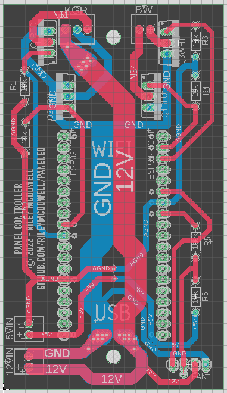

This directory contains a `.f3z` archive that can be loaded into 
Autodesk's Fusion360 to get a complete copy of the PCB design documents
including schematic, board layout, and 3D rendering.

Autodesk offers a free, personal, non-commercial-use version of 
Fusion360, so if that sounds like you and you don't have a philosophical 
objection to the use of nonfree Fusion360 and/or Autodesk just make
an account, download it, and open the `.f3z` file to get access to
everything.

---

In addition, I've copied the individual schematic and board layout files
here for anyone who wishes to use alternative tooling or just get a 
copy of the exported board to order from a PCB prototyping house.

* Board (Gerber) files - `PCB v14_2023-02-12.zip`
* Schematic - `Schematic v10.pdf`

Below are a couple of screenshots you can use to confirm that your tools
have correctly read the source files.

The board layout should look like this:

And the schematic like this:

